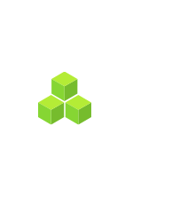

# Cubes

## Definition

```
{
  _style: { 
    entity: 'image;aspect=fixed;html=1;points=[];align=center;fontSize=12;image=img/lib/azure2/general/Cubes.svg;strokeColor=none;',
  },
  _original_width: 67,
  _original_height: 68,
}
```

## Usage

```
import { Cubes } from '@diac/standard-components-diagrams/azure2General'

<Cubes/>
```

## Preview


