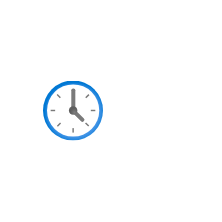

# Recent

## Definition

```
{
  _style: 'image;aspect=fixed;html=1;points=[];align=center;fontSize=12;image=img/lib/azure2/general/Recent.svg;strokeColor=none;',
  _width: 60,
  _height: 60,
}
```

## Usage

```
import { Recent } from '@diac/standard-components-diagrams/azure2General'

<Recent/>
```

## Preview


