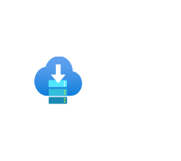

# Service Bus

## Definition

```
{
  _style: 'image;aspect=fixed;html=1;points=[];align=center;fontSize=12;image=img/lib/azure2/general/Service_Bus.svg;strokeColor=none;',
  _width: 70,
  _height: 60,
}
```

## Usage

```
import { ServiceBus } from '@reactiac/standard-components-diagrams/azure2General'

<ServiceBus/>
```

## Preview


