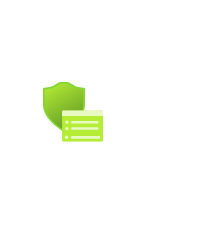

# Device Security Google

## Definition

```
{
  _style: 'image;aspect=fixed;html=1;points=[];align=center;fontSize=12;image=img/lib/azure2/intune/Device_Security_Google.svg;strokeColor=none;',
  _width: 68,
  _height: 69,
}
```

## Usage

```
import { DeviceSecurityGoogle } from '@reactiac/standard-components-diagrams/azure2Intune'

<DeviceSecurityGoogle/>
```

## Preview


