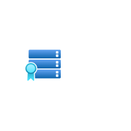

# Stack HCI Premium

## Definition

```
{
  _style: 'image;aspect=fixed;html=1;points=[];align=center;fontSize=12;image=img/lib/azure2/iot/Stack_HCI_Premium.svg;strokeColor=none;',
  _width: 68,
  _height: 68,
}
```

## Usage

```
import { StackHciPremium } from '@reactiac/standard-components-diagrams/azure2Iot'

<StackHciPremium/>
```

## Preview


