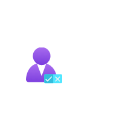

# Customer Lockbox for MS Azure

## Definition

```
{
  _style: 'image;aspect=fixed;html=1;points=[];align=center;fontSize=12;image=img/lib/azure2/management_governance/Customer_Lockbox_for_MS_Azure.svg;strokeColor=none;',
  _width: 68,
  _height: 66.4,
}
```

## Usage

```
import { CustomerLockboxForMsAzure } from '@diac/standard-components-diagrams/azure2ManagementAndGovernance'

<CustomerLockboxForMsAzure/>
```

## Preview


