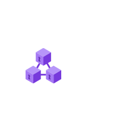

# Confidential_Ledger

## Definition

```
{
  _style: 'image;aspect=fixed;html=1;points=[];align=center;fontSize=12;image=img/lib/azure2/other/Confidential_Ledger.svg;strokeColor=none;',
  _width: 60,
  _height: 60,
}
```

## Usage

```
import { ConfidentialLedger } from '@diac/standard-components-diagrams/azure2Other'

<ConfidentialLedger/>
```

## Preview


