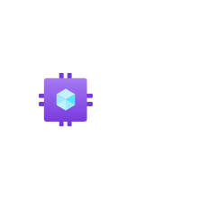
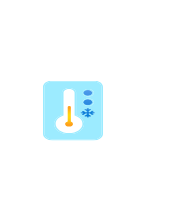
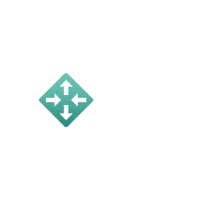
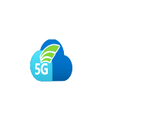
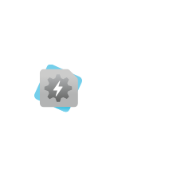
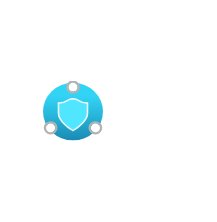
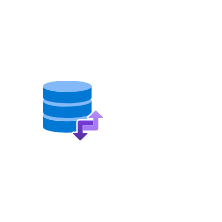
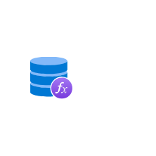
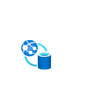

# Azure2 Other Entities

- [A](./a.md)  

- [AadLicenses](./aad-licenses.md)  

- [AcsSolutionsBuilder](./acs-solutions-builder.md)  

- [AksAutomatic](./aks-automatic.md)  

- [AksIstio](./aks-istio.md)  

- [ApiProxy](./api-proxy.md)  

- [AppComplianceAutomation](./app-compliance-automation.md)  

- [AppRegistrations](./app-registrations.md)  

- [AppSpaceCompoment](./app-space-compoment.md)  

- [Aquila](./aquila.md)  

- [ArcDataServices](./arc-data-services.md)  

- [ArcKubernetes](./arc-kubernetes.md)  

- [ArcPostgresql](./arc-postgresql.md)  

- [ArcSqlManagedInstance](./arc-sql-managed-instance.md)  

- [ArcSqlServer](./arc-sql-server.md)  

- [AvsVm](./avs-vm.md)  

- [Azureattestation](./azureattestation.md)  

- [Azurite](./azurite.md)  

- [BackupCenter](./backup-center.md)  

- [BackupVault](./backup-vault.md)  

- [BareMetalInfrastructure](./bare-metal-infrastructure.md)  

- [BusinessProcessTracking](./business-process-tracking.md)  

- [CenterForSap](./center-for-sap.md)  

- [CentralServiceInstanceForSap](./central-service-instance-for-sap.md)  

- [Ceres](./ceres.md)  

- [ChaosStudio](./chaos-studio.md)  

- [CloudServicesExtendedSupport](./cloud-services-extended-support.md)  

- [CloudShell](./cloud-shell.md)  

- [CommunicationServices](./communication-services.md)  

- [ComplianceCenter](./compliance-center.md)  

- [ComputeFleet](./compute-fleet.md)  

- [ComputeGalleries](./compute-galleries.md)  

- [ConfidentialLedger](./confidential-ledger.md)  

- [ConnectedCache](./connected-cache.md)  

- [ConnectedVehiclePlatform](./connected-vehicle-platform.md)  

- [ContainerAppEnvironments](./container-app-environments.md)  

- [CostExport](./cost-export.md)  

- [CustomIpPrefix](./custom-ip-prefix.md)  

- [DashboardHub](./dashboard-hub.md)  

- [DataCollectionRules](./data-collection-rules.md)  

- [DatabaseInstanceForSap](./database-instance-for-sap.md)  

- [DedicatedHsm](./dedicated-hsm.md)  

- [DefenderCmLocalManager](./defender-cm-local-manager.md)  

- [DefenderDcsController](./defender-dcs-controller.md)  

- [DefenderDistributerControlSystem](./defender-distributer-control-system.md)  

- [DefenderEngineeringStation](./defender-engineering-station.md)  

- [DefenderExternalManagement](./defender-external-management.md)  

- [DefenderFreezerMonitor](./defender-freezer-monitor.md)  

- [DefenderHistorian](./defender-historian.md)  

- [DefenderHmi](./defender-hmi.md)  

- [DefenderIndustrialPackagingSystem](./defender-industrial-packaging-system.md)  

- [DefenderIndustrialPrinter](./defender-industrial-printer.md)  

- [DefenderIndustrialRobot](./defender-industrial-robot.md)  

- [DefenderIndustrialScaleSystem](./defender-industrial-scale-system.md)  

- [DefenderMarquee](./defender-marquee.md)  

- [DefenderMeter](./defender-meter.md)  

- [DefenderPlc](./defender-plc.md)  

- [DefenderPneumaticDevice](./defender-pneumatic-device.md)  

- [DefenderProgramableBoard](./defender-programable-board.md)  

- [DefenderRelay](./defender-relay.md)  

- [DefenderRobotController](./defender-robot-controller.md)  

- [DefenderRtu](./defender-rtu.md)  

- [DefenderSensor](./defender-sensor.md)  

- [DefenderSlot](./defender-slot.md)  

- [DefenderWebGuidingSystem](./defender-web-guiding-system.md)  

- [DeploymentEnvironments](./deployment-environments.md)  

- [Detonation](./detonation.md)  

- [DevTunnels](./dev-tunnels.md)  

- [DeviceUpdateIotHub](./device-update-iot-hub.md)  

- [DiskPool](./disk-pool.md)  

- [EdgeHardwareCenter](./edge-hardware-center.md)  

- [EdgeManagement](./edge-management.md)  

- [ElasticSan](./elastic-san.md)  

- [EntraConnectHealth](./entra-connect-health.md)  

- [EntraConnectSync](./entra-connect-sync.md)  

- [EntraIdentity](./entra-identity.md)  

- [ExchangeOnPremisesAccess](./exchange-on-premises-access.md)  

- [ExpressRouteTrafficCollector](./express-route-traffic-collector.md)  

- [ExpressrouteDirect](./expressroute-direct.md)  

- [FhirService](./fhir-service.md)  

- [Fiji](./fiji.md)  

- [Grafana](./grafana.md)  

- [HdiAksCluster](./hdi-aks-cluster.md)  

- [HpcWorkbench](./hpc-workbench.md)  

- [IcmTroubleshooting](./icm-troubleshooting.md)  

- [ImageDefinition](./image-definition.md)  

- [ImageVersion](./image-version.md)  

- [InstancePools](./instance-pools.md)  

- [InternetAnalyzerProfiles](./internet-analyzer-profiles.md)  

- [IntuneTrends](./intune-trends.md)  

- [KubernetesFleetManager](./kubernetes-fleet-manager.md)  

- [LoadTesting](./load-testing.md)  

- [LoadTesting2](./load-testing-2.md)  

- [LocalNetworkGateways](./local-network-gateways.md)  

- [LogAnalyticsQueryPack](./log-analytics-query-pack.md)  

- [ManagedDevopsPools](./managed-devops-pools.md)  

- [ManagedFileShares](./managed-file-shares.md)  

- [ManagedInstanceApacheCassandra](./managed-instance-apache-cassandra.md)  

- [MarketplaceManagement](./marketplace-management.md)  

- [MedtechService](./medtech-service.md)  

- [MissionLandingZone](./mission-landing-zone.md)  

- [ModularDataCenter](./modular-data-center.md)  

- [MonitorDashboard](./monitor-dashboard.md)  

- [MonitorHealthModels](./monitor-health-models.md)  

- [MonitorPipeline](./monitor-pipeline.md)  

- [MsDevBox](./ms-dev-box.md)  

- [NetworkFunctionManager](./network-function-manager.md)  

- [NetworkFunctionManagerFunctions](./network-function-manager-functions.md)  

- [NetworkManager](./network-manager.md)  

- [NetworkSecurityPerimeters](./network-security-perimeters.md)  

- [OpenSupplyChainPlatform](./open-supply-chain-platform.md)  

- [Orbital](./orbital.md)  

- [Osconfig](./osconfig.md)  

- [PeeringService](./peering-service.md)  

- [Peerings](./peerings.md)  

- [PrivateEndpoints](./private-endpoints.md)  

- [PrivateMobileNetwork](./private-mobile-network.md)  

- [Quotas](./quotas.md)  

- [ReservedCapacity](./reserved-capacity.md)  

- [ReservedCapacityGroups](./reserved-capacity-groups.md)  

- [ResourceGuard](./resource-guard.md)  

- [ResourceMover](./resource-mover.md)  

- [Rtos](./rtos.md)  

- [SavingsPlan](./savings-plan.md)  

- [ScvmmManagementServers](./scvmm-management-servers.md)  

- [SonicDash](./sonic-dash.md)  

- [Sphere](./sphere.md)  

- [SshKeys](./ssh-keys.md)  

- [StorageActions](./storage-actions.md)  

- [StorageMover](./storage-mover.md)  

- [StorageTasks](./storage-tasks.md)  

- [SupportCenterBlue](./support-center-blue.md)  

- [SupportSustainability](./support-sustainability.md)  

- [TargetsManagement](./targets-management.md)  

- [TemplateSpecs](./template-specs.md)  

- [TestBase](./test-base.md)  

- [UniversalPrint](./universal-print.md)  

- [UpdateCenter](./update-center.md)  

- [VideoAnalyzers](./video-analyzers.md)  

- [VideoIndexer](./video-indexer.md)  

- [VirtualEnclaves](./virtual-enclaves.md)  

- [VirtualInstanceForSap](./virtual-instance-for-sap.md)  

- [VmApplicationDefinition](./vm-application-definition.md)  

- [VmApplicationVersion](./vm-application-version.md)  

- [VmwareSolution](./vmware-solution.md)  

- [Wac](./wac.md)  

- [WacInstaller](./wac-installer.md)  

- [WebAppDatabase](./web-app-database.md)  

- [WebJobs](./web-jobs.md)  

- [WindowsNotificationServices](./windows-notification-services.md)  

- [WindowsVirtualDesktop](./windows-virtual-desktop.md)  

- [WorkerContainerApp](./worker-container-app.md)  

- [WorkspaceGateway](./workspace-gateway.md)  

