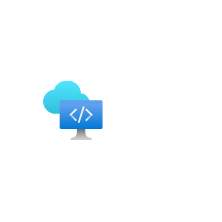

# MS Dev Box

## Definition

```
{
  _style: 'image;aspect=fixed;html=1;points=[];align=center;fontSize=12;image=img/lib/azure2/other/MS_Dev_Box.svg;strokeColor=none;',
  _width: 68,
  _height: 68,
}
```

## Usage

```
import { MsDevBox } from '@reactiac/standard-components-diagrams/azure2Other'

<MsDevBox/>
```

## Preview


