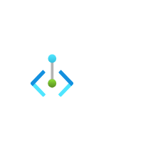

# Private Endpoints

## Definition

```
{
  _style: { 
    entity: 'image;aspect=fixed;html=1;points=[];align=center;fontSize=12;image=img/lib/azure2/other/Private_Endpoints.svg;strokeColor=none;',
  },
  _original_width: 68,
  _original_height: 64.68,
}
```

## Usage

```
import { PrivateEndpoints } from '@dinghy/standard-components-diagrams/azure2Other'

<PrivateEndpoints/>
```

## Preview


