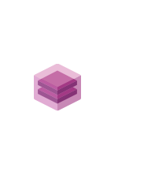

# Reserved Capacity Groups

## Definition

```
{
  _style: 'image;aspect=fixed;html=1;points=[];align=center;fontSize=12;image=img/lib/azure2/other/Reserved_Capacity_Groups.svg;strokeColor=none;',
  _width: 57.99999999999999,
  _height: 68,
}
```

## Usage

```
import { ReservedCapacityGroups } from '@reactiac/standard-components-diagrams/azure2Other'

<ReservedCapacityGroups/>
```

## Preview


