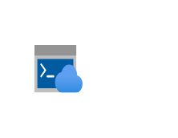
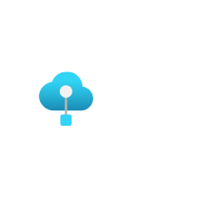
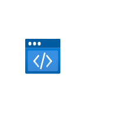
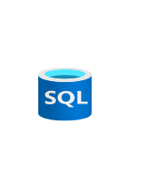

# Azure2 Preview Entities

- [CloudShell](./cloud-shell.md)  

- [IotEdge](./iot-edge.md)  

- [PrivateLinkHub](./private-link-hub.md)  

- [Rtos](./rtos.md)  

- [Sphere](./sphere.md)  

- [StaticApps](./static-apps.md)  

- [TimeSeriesDataSets](./time-series-data-sets.md)  

- [WebEnvironment](./web-environment.md)  

- [Workbooks](./workbooks.md)  

