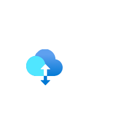

# Azure2 Storage Entities

- [DataBox](./data-box.md)  

- [DataBoxEdge](./data-box-edge.md)  

- [DataLakeStorageGen1](./data-lake-storage-gen1.md)  

- [DataShareInvitations](./data-share-invitations.md)  

- [DataShares](./data-shares.md)  

- [Fileshare](./fileshare.md)  

- [HcpCache](./hcp-cache.md)  

- [ImportExportJobs](./import-export-jobs.md)  

- [NetappFiles](./netapp-files.md)  

- [RecoveryServicesVaults](./recovery-services-vaults.md)  

- [StackEdge](./stack-edge.md)  

- [StorageAccounts](./storage-accounts.md)  

- [StorageAccountsClassic](./storage-accounts-classic.md)  

- [StorageExplorer](./storage-explorer.md)  

- [StorageSyncServices](./storage-sync-services.md)  

- [StorsimpleDataManagers](./storsimple-data-managers.md)  

- [StorsimpleDeviceManagers](./storsimple-device-managers.md)  

