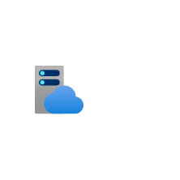

# Azure2 Web Entities

- [ApiCenter](./api-center.md)  

- [ApiConnections](./api-connections.md)  

- [ApiManagementServices](./api-management-services.md)  

- [AppServiceCertificates](./app-service-certificates.md)  

- [AppServiceDomains](./app-service-domains.md)  

- [AppServiceEnvironments](./app-service-environments.md)  

- [AppServicePlans](./app-service-plans.md)  

- [AppServices](./app-services.md)  

- [AppSpace](./app-space.md)  

- [CognitiveSearch](./cognitive-search.md)  

- [CognitiveServices](./cognitive-services.md)  

- [FrontDoorAndCdnProfiles](./front-door-and-cdn-profiles.md)  

- [MediaService](./media-service.md)  

- [NotificationHubNamespaces](./notification-hub-namespaces.md)  

- [PowerPlatform](./power-platform.md)  

- [Signalr](./signalr.md)  

- [SpringApps](./spring-apps.md)  

- [StaticApps](./static-apps.md)  

