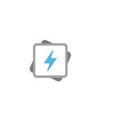
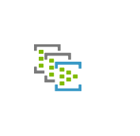
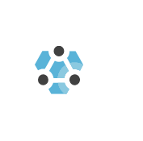

# Cae Analytics Service Entities

- [AnalysisServices](./analysis-services.md)  

- [AzureDataExplorerClusters](./azure-data-explorer-clusters.md)  

- [DataFactories](./data-factories.md)  

- [DataLakeAnalytics](./data-lake-analytics.md)  

- [DataLakeStore](./data-lake-store.md)  

- [Databricks](./databricks.md)  

- [EventHubClusters](./event-hub-clusters.md)  

- [EventHubs](./event-hubs.md)  

- [HdinsightClusters](./hdinsight-clusters.md)  

- [LogAnalyticsWorkspaces](./log-analytics-workspaces.md)  

- [StreamAnalytics](./stream-analytics.md)  

