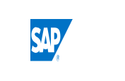
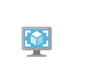

# Cae Compute Service Entities

- [BatchAccounts](./batch-accounts.md)  

- [CitrixVirtualDesktopsEssentials](./citrix-virtual-desktops-essentials.md)  

- [CloudServices](./cloud-services.md)  

- [CloudServicesClassic](./cloud-services-classic.md)  

- [CloudsimpleVirtualMachines](./cloudsimple-virtual-machines.md)  

- [DiskSnapshots](./disk-snapshots.md)  

- [Disks](./disks.md)  

- [FunctionApps](./function-apps.md)  

- [SapHanaOnAzure](./sap-hana-on-azure.md)  

- [ServiceFabric](./service-fabric.md)  

- [VmImages](./vm-images.md)  

