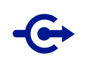

# Connectors

## Definition

```
{
  _style: 'sketch=0;aspect=fixed;pointerEvents=1;shadow=0;dashed=0;html=1;strokeColor=none;labelPosition=center;verticalLabelPosition=bottom;verticalAlign=top;align=center;fillColor=#00188D;shape=mxgraph.mscae.enterprise.connectors',
  _width: 50,
  _height: 34,
}
```

## Usage

```
import { Connectors } from '@reactiac/standard-components-diagrams/caeEnterpriseFlat'

<Connectors/>
```

## Preview


