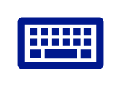

# Keyboard

## Definition

```
{
  _style: { 
    entity: 'sketch=0;aspect=fixed;pointerEvents=1;shadow=0;dashed=0;html=1;strokeColor=none;labelPosition=center;verticalLabelPosition=bottom;verticalAlign=top;align=center;fillColor=#00188D;shape=mxgraph.mscae.enterprise.keyboard',
  },
  _original_width: 50,
  _original_height: 30,
}
```

## Usage

```
import { Keyboard } from '@diac/standard-components-diagrams/caeEnterpriseFlat'

<Keyboard/>
```

## Preview


