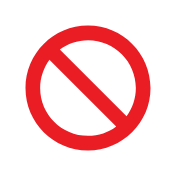

# Not Allowed

## Definition

```
{
  _style: { 
    entity: 'sketch=0;aspect=fixed;pointerEvents=1;shadow=0;dashed=0;html=1;strokeColor=none;labelPosition=center;verticalLabelPosition=bottom;verticalAlign=top;align=center;shape=mxgraph.mscae.enterprise.not_allowed;fillColor=#EA1C24;',
  },
  _width: 60,
  _height: 60,
}
```

## Usage

```
import { NotAllowed } from '@diac/standard-components-diagrams/caeEnterpriseFlat'

<NotAllowed/>
```

## Preview


