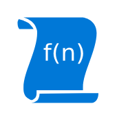

# UDF Function

## Definition

```
{
  _style: 'sketch=0;aspect=fixed;pointerEvents=1;shadow=0;dashed=0;html=1;strokeColor=none;labelPosition=center;verticalLabelPosition=bottom;verticalAlign=top;align=center;shape=mxgraph.mscae.enterprise.udf_function;fillColor=#0078D7;',
  _width: 47,
  _height: 50,
}
```

## Usage

```
import { UdfFunction } from '@diac/standard-components-diagrams/caeEnterpriseFlat'

<UdfFunction/>
```

## Preview


