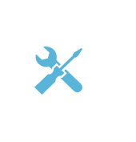

# Tools

## Definition

```
{
  _style: { 
    entity: 'image;sketch=0;aspect=fixed;html=1;points=[];align=center;fontSize=12;image=img/lib/mscae/Tools.svg;strokeColor=none;',
  },
  _original_width: 47,
  _original_height: 50,
}
```

## Usage

```
import { Tools } from '@dinghy/standard-components-diagrams/caeIntuneService'

<Tools/>
```

## Preview


