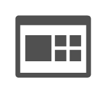

# Dashboard

## Definition

```
{
  _style: 'sketch=0;pointerEvents=1;shadow=0;dashed=0;html=1;strokeColor=none;labelPosition=center;verticalLabelPosition=bottom;verticalAlign=top;align=center;fillColor=#505050;shape=mxgraph.mscae.oms.dashboard',
  _width: 50,
  _height: 41,
}
```

## Usage

```
import { Dashboard } from '@reactiac/standard-components-diagrams/caeOmsFlat'

<Dashboard/>
```

## Preview


