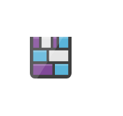

# Blob Storage

## Definition

```
{
  _style: { 
    entity: 'image;sketch=0;aspect=fixed;html=1;points=[];align=center;fontSize=12;image=img/lib/mscae/Blog_Storage.svg;strokeColor=none;',
  },
  _original_width: 50,
  _original_height: 46,
}
```

## Usage

```
import { BlobStorage } from '@diac/standard-components-diagrams/caeStorageService'

<BlobStorage/>
```

## Preview


