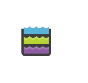

# Data Lake Storage

## Definition

```
{
  _style: 'image;sketch=0;aspect=fixed;html=1;points=[];align=center;fontSize=12;image=img/lib/mscae/Data_Lake_Storage.svg;strokeColor=none;',
  _width: 50,
  _height: 46,
}
```

## Usage

```
import { DataLakeStorage } from '@reactiac/standard-components-diagrams/caeStorageService'

<DataLakeStorage/>
```

## Preview


