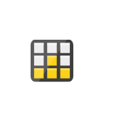

# Cae Storage Service Entities

- [ArchiveStorage](./archive-storage.md)  

- [AzureNetappFiles](./azure-netapp-files.md)  

- [Azurefxtedgefiler](./azurefxtedgefiler.md)  

- [BlobStorage](./blob-storage.md)  

- [ClassicStorage](./classic-storage.md)  

- [DataBoxImportExportStorage](./data-box-import-export-storage.md)  

- [DataBoxEdgeDataBoxGateway](./data-box-edge-data-box-gateway.md)  

- [DataLakeStorage](./data-lake-storage.md)  

- [GeneralStorage](./general-storage.md)  

- [QueuesStorage](./queues-storage.md)  

- [StorageAccounts](./storage-accounts.md)  

- [StorageExplorer](./storage-explorer.md)  

- [StorageSyncServices](./storage-sync-services.md)  

- [Storsimple](./storsimple.md)  

- [StorsimpleDataManagers](./storsimple-data-managers.md)  

- [StorsimpleDeviceManagers](./storsimple-device-managers.md)  

- [TableStorage](./table-storage.md)  

