# Cisco Collaboration Entities

- [AdDecoder](./ad-decoder.md)  
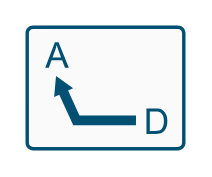

- [AdEncoder](./ad-encoder.md)  
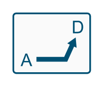

- [Camera](./camera.md)  

- [CiscoMeetingplaceExpress](./cisco-meetingplace-express.md)  
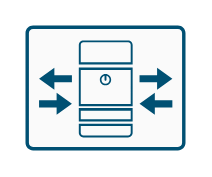

- [CiscoUnifiedContactCenterEnterpriseAndHosted](./cisco-unified-contact-center-enterprise-and-hosted.md)  

- [CiscoUnifiedPresenceService](./cisco-unified-presence-service.md)  

- [Clock](./clock.md)  

- [Collaboration](./collaboration.md)  
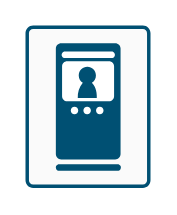

- [Collaboration2](./collaboration-2.md)  
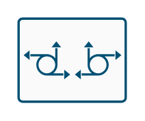

- [Collaboration3](./collaboration-3.md)  
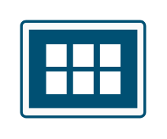

- [Collaboration4](./collaboration-4.md)  
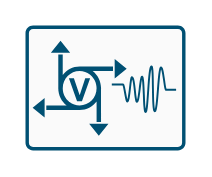

- [CommunicationsManager](./communications-manager.md)  
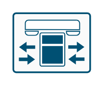

- [ContactCenterExpress](./contact-center-express.md)  
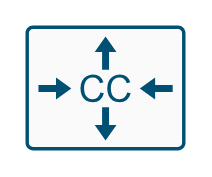

- [ContentRecordingStreamingServer](./content-recording-streaming-server.md)  
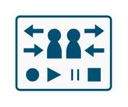

- [DaDecoder](./da-decoder.md)  

- [DaEncoder](./da-encoder.md)  
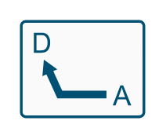

- [H323](./h-323.md)  
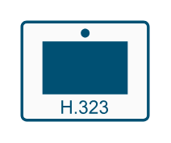

- [Hdtv](./hdtv.md)  

- [ImmersiveTelepresenceEndpoint](./immersive-telepresence-endpoint.md)  
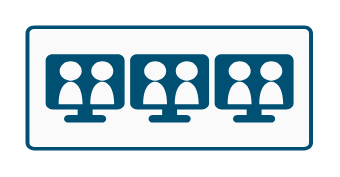

- [IpIpGateway](./ip-ip-gateway.md)  
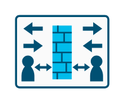

- [IpPhone](./ip-phone.md)  

- [JoystickKeyboard](./joystick-keyboard.md)  

- [LaptopVideoClient](./laptop-video-client.md)  

- [MediaServer](./media-server.md)  
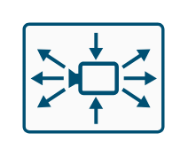

- [MeetingSchedulingAndManagementServer](./meeting-scheduling-and-management-server.md)  
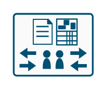

- [Monitor](./monitor.md)  
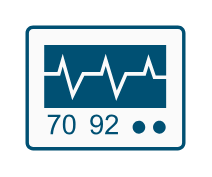

- [MultipointMeetingServer](./multipoint-meeting-server.md)  
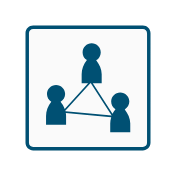

- [OperationsManager](./operations-manager.md)  
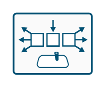

- [PhonePolycom](./phone-polycom.md)  

- [PrimaryCodec](./primary-codec.md)  
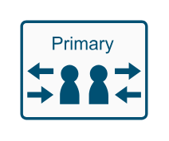

- [SecondaryCodec](./secondary-codec.md)  
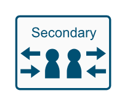

- [SetTop](./set-top.md)  
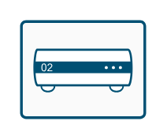

- [Shield](./shield.md)  

- [SurveillanceCamera](./surveillance-camera.md)  

- [TelepresenceEndpoint](./telepresence-endpoint.md)  

- [TelepresenceEndpointTwinDataDisplay](./telepresence-endpoint-twin-data-display.md)  
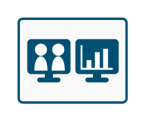

- [TelepresenceExchange](./telepresence-exchange.md)  
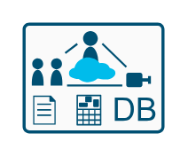

- [Transcoder](./transcoder.md)  
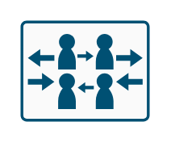

- [Unity](./unity.md)  

- [UpcUnifiedPersonalCommunicator](./upc-unified-personal-communicator.md)  

- [VideoAnalytics](./video-analytics.md)  

- [VideoCallServer](./video-call-server.md)  
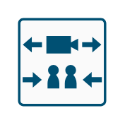

- [VideoGateway](./video-gateway.md)  
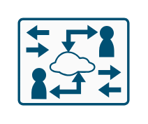

- [VirtualDesktopService](./virtual-desktop-service.md)  
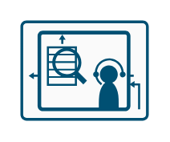

- [Webex](./webex.md)  

