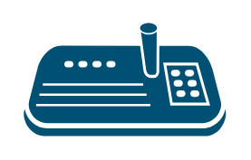

# Joystick Keyboard

## Definition

```
{
  _style: 'points=[[0.13,0.24,0],[0.5,0.2,0],[0.62,0,0],[0.87,0.24,0],[0.95,0.55,0],[0.96,0.95,0],[0.5,1,0],[0.04,0.95,0],[0.05,0.55,0]];verticalLabelPosition=bottom;sketch=0;html=1;verticalAlign=top;aspect=fixed;align=center;pointerEvents=1;shape=mxgraph.cisco19.joystick_keyboard;fillColor=#005073;strokeColor=none;',
  _width: 90,
  _height: 50,
}
```

## Usage

```
import { JoystickKeyboard } from '@diac/standard-components-diagrams/cisco19Collaboration'

<JoystickKeyboard/>
```

## Preview


