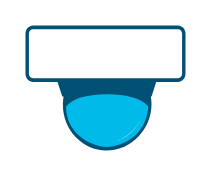

# Surveillance Camera

## Definition

```
{
  _style: 'points=[[0.015,0.015,0],[0.5,0,0],[0.985,0.015,0],[1,0.22,0],[0.985,0.43,0],[0.73,0.85,0],[0.5,1,0],[0.285,0.85,0],[0.015,0.43,0],[0,0.22,0]];verticalLabelPosition=bottom;sketch=0;html=1;verticalAlign=top;aspect=fixed;align=center;pointerEvents=1;shape=mxgraph.cisco19.surveillance_camera;fillColor=#005073;strokeColor=none;',
  _width: 64,
  _height: 50,
}
```

## Usage

```
import { SurveillanceCamera } from '@reactiac/standard-components-diagrams/cisco19Collaboration'

<SurveillanceCamera/>
```

## Preview


