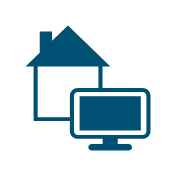

# Home Office

## Definition

```
{
  _style: 'points=[[0.115,0.05,0],[0.335,0,0],[0.98,0.52,0],[1,0.71,0],[0.68,1,0],[0.065,0.76,0],[0,0.33,0],[0.68,0.33,0]];verticalLabelPosition=bottom;sketch=0;html=1;verticalAlign=top;aspect=fixed;align=center;pointerEvents=1;shape=mxgraph.cisco19.home_office;fillColor=#005073;strokeColor=none;',
  _width: 50,
  _height: 50,
}
```

## Usage

```
import { HomeOffice } from '@reactiac/standard-components-diagrams/cisco19EndpointClientAndDeviceIcons'

<HomeOffice/>
```

## Preview


