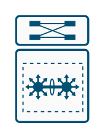
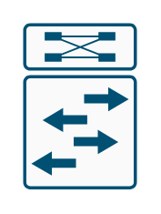
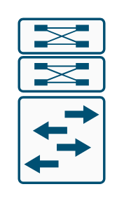
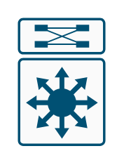
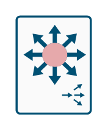
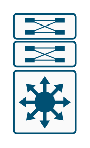

# Cisco LAN Switching Entities

- [Component6500Vss](./component-6500-vss.md)  

- [L2Modular](./l2-modular.md)  

- [L2Modular2](./l2-modular-2.md)  

- [L2Switch](./l2-switch.md)  

- [L2SwitchWithDualSupervisor](./l2-switch-with-dual-supervisor.md)  

- [L3Modular](./l3-modular.md)  

- [L3Modular2](./l3-modular-2.md)  

- [L3Modular3](./l3-modular-3.md)  

- [L3Switch](./l3-switch.md)  

- [L3SwitchWithDualSupervisor](./l3-switch-with-dual-supervisor.md)  

- [SecureCatalystSwitchColor](./secure-catalyst-switch-color.md)  

- [SecureCatalystSwitchColor2](./secure-catalyst-switch-color-2.md)  

- [SecureCatalystSwitchColor3](./secure-catalyst-switch-color-3.md)  

- [SecureCatalystSwitchSubdued](./secure-catalyst-switch-subdued.md)  

- [SecureCatalystSwitchSubdued2](./secure-catalyst-switch-subdued-2.md)  

- [SecureSwitchColor](./secure-switch-color.md)  

- [SecureSwitchSubdued](./secure-switch-subdued.md)  

- [WorkgroupSwitchColor](./workgroup-switch-color.md)  

- [WorkgroupSwitchSubdued](./workgroup-switch-subdued.md)  

