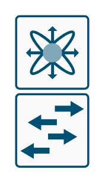

# L2 Modular 2

## Definition

```
{
  _style: 'sketch=0;points=[[0.015,0.015,0],[0.985,0.015,0],[0.985,0.985,0],[0.015,0.985,0],[0.25,0,0],[0.5,0,0],[0.75,0,0],[1,0.25,0],[1,0.5,0],[1,0.75,0],[0.75,1,0],[0.5,1,0],[0.25,1,0],[0,0.75,0],[0,0.5,0],[0,0.25,0]];verticalLabelPosition=bottom;html=1;verticalAlign=top;aspect=fixed;align=center;pointerEvents=1;shape=mxgraph.cisco19.rect;prIcon=l2_modular2;fillColor=#FAFAFA;strokeColor=#005073;',
  _width: 50,
  _height: 102.49999999999999,
}
```

## Usage

```
import { L2Modular2 } from '@diac/standard-components-diagrams/cisco19LanSwitching'

<L2Modular2/>
```

## Preview


