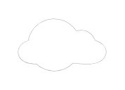

# Cloud 2

## Definition

```
{
  _style: { 
    entity: 'points=[[0,0.64,0],[0.2,0.15,0],[0.4,0.01,0],[0.79,0.25,0],[1,0.65,0],[0.8,0.86,0],[0.41,1,0],[0.16,0.86,0]];verticalLabelPosition=bottom;sketch=0;html=1;verticalAlign=top;aspect=fixed;align=center;pointerEvents=1;shape=mxgraph.cisco19.cloud;fillColor=#A6A6A6;strokeColor=none;',
  },
  _original_width: 50,
  _original_height: 30,
}
```

## Usage

```
import { Cloud2 } from '@diac/standard-components-diagrams/cisco19SecurityCloudsAndConnectors'

<Cloud2/>
```

## Preview


