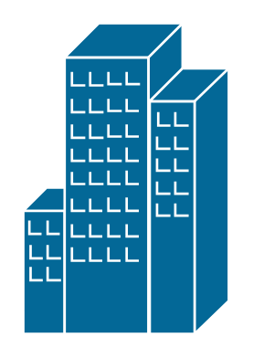
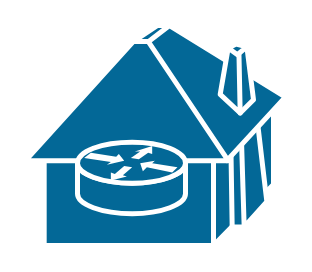

# Cisco Buildings Entities

- [BranchOffice](./branch-office.md)  

- [EndOffice](./end-office.md)  

- [GenericBuilding](./generic-building.md)  

- [GovernmentBuilding](./government-building.md)  

- [Mdu](./mdu.md)  

- [SmallBusiness](./small-business.md)  

- [TelecommuterHouse](./telecommuter-house.md)  

- [TelecommuterHousePc](./telecommuter-house-pc.md)  

- [University](./university.md)  

