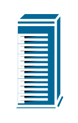
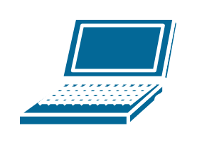
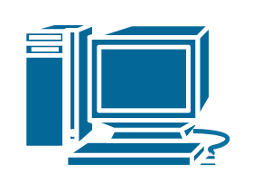
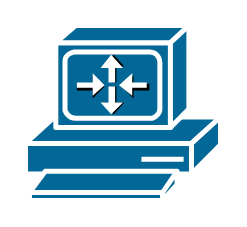
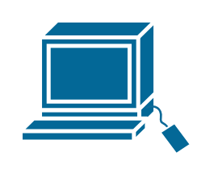
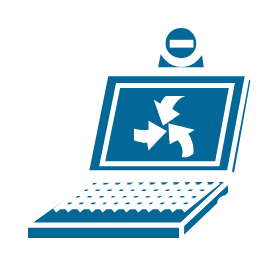
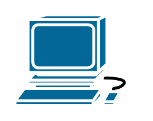

# Cisco Computers and Peripherals Entities

- [IbmMainframe](./ibm-mainframe.md)  

- [IbmMiniAs400](./ibm-mini-as400.md)  

- [IbmTower](./ibm-tower.md)  

- [Laptop](./laptop.md)  

- [Macintosh](./macintosh.md)  

- [Microphone](./microphone.md)  

- [Pc](./pc.md)  

- [PcAdapterCard](./pc-adapter-card.md)  

- [PcRoutercard](./pc-routercard.md)  

- [Printer](./printer.md)  

- [Scanner](./scanner.md)  

- [Speaker](./speaker.md)  

- [SunWorkstation](./sun-workstation.md)  

- [Supercomputer](./supercomputer.md)  

- [Tablet](./tablet.md)  

- [Terminal](./terminal.md)  

- [Upc](./upc.md)  

- [VideoCamera](./video-camera.md)  

- [WebBrowser](./web-browser.md)  

- [Workstation](./workstation.md)  

