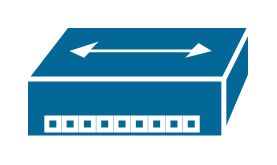

# Cisco Hubs and Gateways Entities

- [Component100basetHub](./component-100baset-hub.md)  

- [CiscoHub](./cisco-hub.md)  

- [GenericGateway](./generic-gateway.md)  

- [Hub](./hub.md)  

- [MasGateway](./mas-gateway.md)  

- [SmallHub](./small-hub.md)  

- [UniversalGateway](./universal-gateway.md)  

- [VpnGateway](./vpn-gateway.md)  

