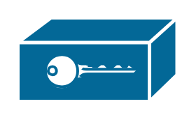

# VPN Gateway

## Definition

```
{
  _style: { 
    entity: 'shape=mxgraph.cisco.hubs_and_gateways.vpn_gateway;sketch=0;html=1;pointerEvents=1;dashed=0;fillColor=#036897;strokeColor=#ffffff;strokeWidth=2;verticalLabelPosition=bottom;verticalAlign=top;align=center;outlineConnect=0;',
  },
  _width: 91,
  _height: 48,
}
```

## Usage

```
import { VpnGateway } from '@diac/standard-components-diagrams/ciscoHubsAndGateways'

<VpnGateway/>
```

## Preview


