# Cisco Misc Entities

- [Component15200](./component-15200.md)  

- [Component6700Series](./component-6700-series.md)  

- [Component7500ars7513](./component-7500ars-7513.md)  

- [AccessPoint](./access-point.md)  
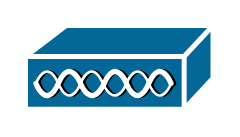

- [Ace](./ace.md)  

- [Acs](./acs.md)  

- [Adm](./adm.md)  
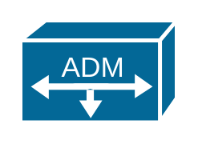

- [Asa5500](./asa-5500.md)  

- [AsicProcessor](./asic-processor.md)  
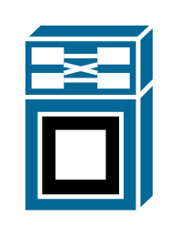

- [Asr1000Series](./asr-1000-series.md)  
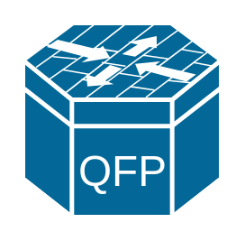

- [Ata](./ata.md)  
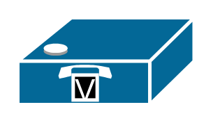

- [Atm3800](./atm-3800.md)  

- [Avs](./avs.md)  
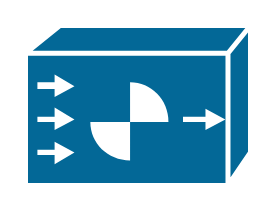

- [Axp](./axp.md)  

- [Bbsm](./bbsm.md)  
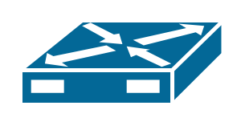

- [BreakoutBox](./breakout-box.md)  
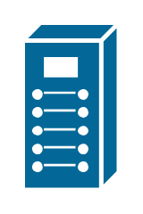

- [Bridge](./bridge.md)  

- [Bts10200](./bts-10200.md)  

- [CallManager](./call-manager.md)  
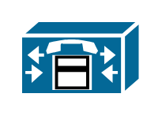

- [Car](./car.md)  

- [CarrierRoutingSystem](./carrier-routing-system.md)  

- [CddiFddi](./cddi-fddi.md)  
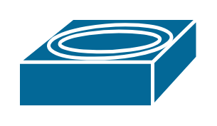

- [Cdm](./cdm.md)  
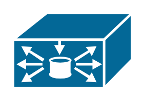

- [Cisco1000](./cisco-1000.md)  

- [CiscoCa](./cisco-ca.md)  
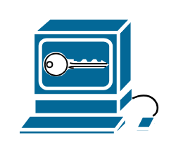

- [CiscoUnityExpress](./cisco-unity-express.md)  

- [CiscoWorks](./cisco-works.md)  

- [ContactAcquirer](./contact-acquirer.md)  
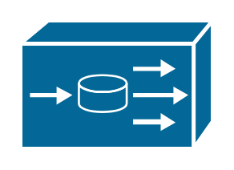

- [ContactCenter](./contact-center.md)  

- [ContentTransformationEngineCte](./content-transformation-engine-cte.md)  
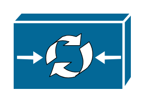

- [CsMars](./cs-mars.md)  
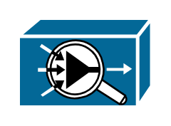

- [CsmS](./csm-s.md)  

- [CsuDsu](./csu-dsu.md)  

- [Cube](./cube.md)  

- [Detector](./detector.md)  
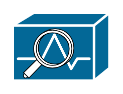

- [DotDot](./dot-dot.md)  

- [Dpt](./dpt.md)  

- [Dslam](./dslam.md)  

- [DualMode](./dual-mode.md)  
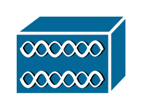

- [DwdmFilter](./dwdm-filter.md)  

- [FddiRing](./fddi-ring.md)  

- [FrontEndProcessor](./front-end-processor.md)  

- [GeneralAppliance](./general-appliance.md)  

- [GenericProcessor](./generic-processor.md)  
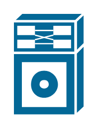

- [H323](./h-323.md)  
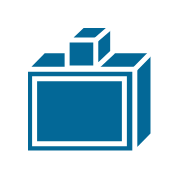

- [Handheld](./handheld.md)  

- [HpMini](./hp-mini.md)  

- [Icm](./icm.md)  

- [Ics](./ics.md)  

- [InternetStreamer](./internet-streamer.md)  

- [IosSlb](./ios-slb.md)  
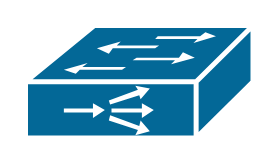

- [Ip](./ip.md)  
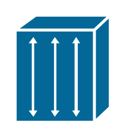

- [IpCommunicator](./ip-communicator.md)  

- [IpDsl](./ip-dsl.md)  
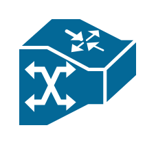

- [Iptc](./iptc.md)  
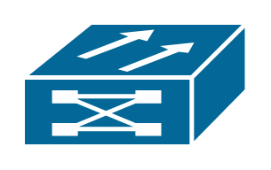

- [IptvContentManager](./iptv-content-manager.md)  
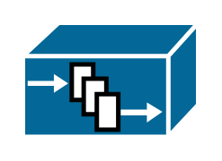

- [Itp](./itp.md)  

- [Jbod](./jbod.md)  
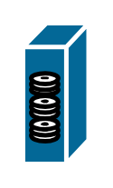

- [Key](./key.md)  

- [Keys](./keys.md)  
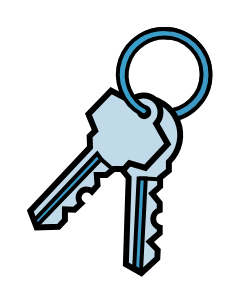

- [LanToLan](./lan-to-lan.md)  

- [LightweightAp](./lightweight-ap.md)  
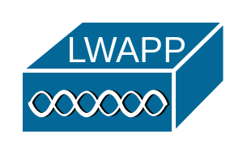

- [LongreachCpe](./longreach-cpe.md)  

- [Mau](./mau.md)  

- [Mcu](./mcu.md)  

- [Me1100](./me1100.md)  
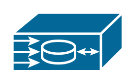

- [Mediator](./mediator.md)  

- [Meetingplace](./meetingplace.md)  
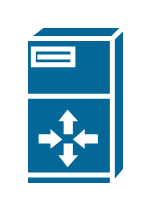

- [MeshAp](./mesh-ap.md)  
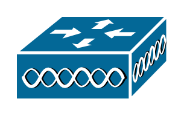

- [Metro1500](./metro-1500.md)  

- [MiniVax](./mini-vax.md)  

- [MobileStreamer](./mobile-streamer.md)  

- [Mse](./mse.md)  

- [Mux](./mux.md)  

- [Mxe](./mxe.md)  

- [NacAppliance](./nac-appliance.md)  
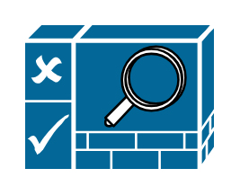

- [Nce](./nce.md)  

- [Netranger](./netranger.md)  

- [Netsonar](./netsonar.md)  

- [NetworkManagement](./network-management.md)  

- [Nexus1000](./nexus-1000.md)  
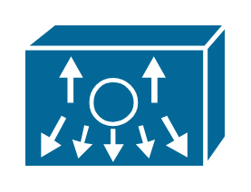

- [Nexus2000FabricExtender](./nexus-2000-fabric-extender.md)  

- [Nexus5000](./nexus-5000.md)  

- [Nexus7000](./nexus-7000.md)  
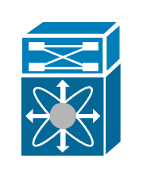

- [Octel](./octel.md)  

- [Ons15500](./ons15500.md)  
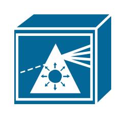

- [OpticalAmplifier](./optical-amplifier.md)  

- [OpticalTransport](./optical-transport.md)  
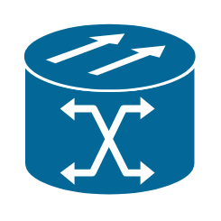

- [Pad1](./pad-1.md)  

- [Pad2](./pad-2.md)  

- [PageIcon](./page-icon.md)  

- [Pbx](./pbx.md)  

- [PcSoftware](./pc-software.md)  

- [PcVideo](./pc-video.md)  

- [Pda](./pda.md)  

- [Pmc](./pmc.md)  

- [ProtocolTranslator](./protocol-translator.md)  
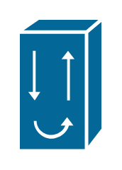

- [Pxf](./pxf.md)  

- [Ratemux](./ratemux.md)  

- [Repeater](./repeater.md)  

- [RouteSwitchProcessor](./route-switch-processor.md)  

- [Rpsrps](./rpsrps.md)  

- [ServiceControl](./service-control.md)  

- [Services](./services.md)  

- [SetTopBox](./set-top-box.md)  

- [Ssc](./ssc.md)  

- [SslTerminator](./ssl-terminator.md)  

- [Stb](./stb.md)  

- [Stp](./stp.md)  

- [Streamer](./streamer.md)  

- [Svx](./svx.md)  
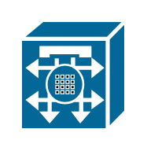

- [TelecommuterIcon](./telecommuter-icon.md)  

- [Telepresence](./telepresence.md)  
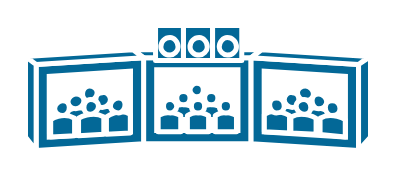

- [Token](./token.md)  

- [TpMcu](./tp-mcu.md)  

- [Transpath](./transpath.md)  

- [Truck](./truck.md)  
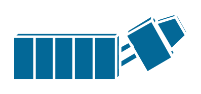

- [Turret](./turret.md)  
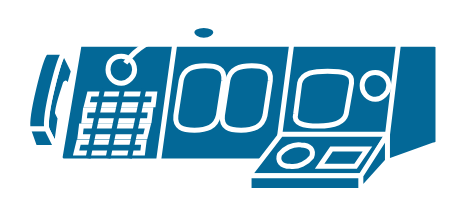

- [Tv](./tv.md)  

- [Ubr910](./ubr910.md)  

- [UmgSeries](./umg-series.md)  
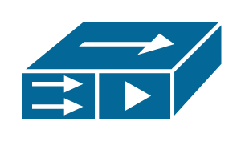

- [Ups](./ups.md)  

- [Vault](./vault.md)  

- [Vip](./vip.md)  
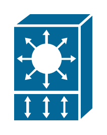

- [VpnConcentrator](./vpn-concentrator.md)  

- [Vss](./vss.md)  
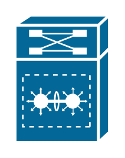

- [Wae](./wae.md)  
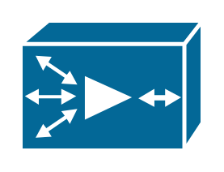

- [Wism](./wism.md)  
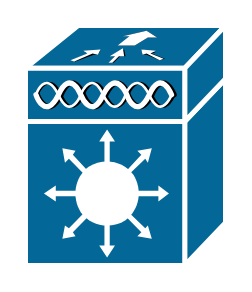
