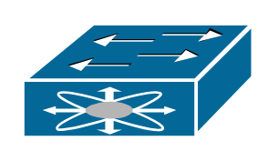

# Nexus 5000

## Definition

```
{
  _style: { 
    entity: 'shape=mxgraph.cisco.misc.nexus_5000;sketch=0;html=1;pointerEvents=1;dashed=0;fillColor=#036897;strokeColor=#ffffff;strokeWidth=2;verticalLabelPosition=bottom;verticalAlign=top;align=center;outlineConnect=0;',
  },
  _original_width: 101,
  _original_height: 50,
}
```

## Usage

```
import { Nexus5000 } from '@dinghy/standard-components-diagrams/ciscoMisc'

<Nexus5000/>
```

## Preview


