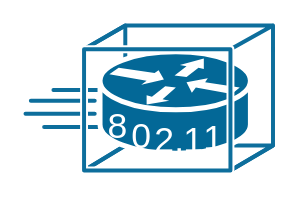

# Mobile Access Router

## Definition

```
{
  _style: { 
    entity: 'shape=mxgraph.cisco.routers.mobile_access_router;sketch=0;html=1;pointerEvents=1;dashed=0;fillColor=#036897;strokeColor=#ffffff;strokeWidth=2;verticalLabelPosition=bottom;verticalAlign=top;align=center;outlineConnect=0;',
  },
  _original_width: 99,
  _original_height: 58,
}
```

## Usage

```
import { MobileAccessRouter } from '@dinghy/standard-components-diagrams/ciscoRouters'

<MobileAccessRouter/>
```

## Preview


