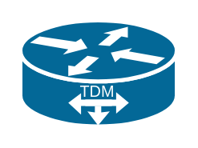

# TDM Router

## Definition

```
{
  _style: 'shape=mxgraph.cisco.routers.tdm_router;sketch=0;html=1;pointerEvents=1;dashed=0;fillColor=#036897;strokeColor=#ffffff;strokeWidth=2;verticalLabelPosition=bottom;verticalAlign=top;align=center;outlineConnect=0;',
  _width: 78,
  _height: 53,
}
```

## Usage

```
import { TdmRouter } from '@reactiac/standard-components-diagrams/ciscoRouters'

<TdmRouter/>
```

## Preview


