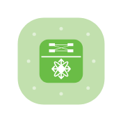

# Nexus Data Center Switch

## Definition

```
{
  _style: { 
    entity: 'verticalLabelPosition=bottom;sketch=0;html=1;fillColor=#6ABD46;strokeColor=#ffffff;verticalAlign=top;align=center;points=[[0.085,0.085,0],[0.915,0.085,0],[0.915,0.915,0],[0.085,0.915,0],[0.25,0,0],[0.5,0,0],[0.75,0,0],[1,0.25,0],[1,0.5,0],[1,0.75,0],[0.75,1,0],[0.5,1,0],[0.25,1,0],[0,0.75,0],[0,0.5,0],[0,0.25,0]];pointerEvents=1;shape=mxgraph.cisco_safe.compositeIcon;bgIcon=mxgraph.cisco_safe.architecture.generic_appliance;resIcon=mxgraph.cisco_safe.architecture.nexus_data_center_switch;',
  },
  _width: 60,
  _height: 60,
}
```

## Usage

```
import { NexusDataCenterSwitch } from '@diac/standard-components-diagrams/ciscoSafeArchitecture'

<NexusDataCenterSwitch/>
```

## Preview


