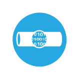
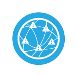

# Cisco Capability Entities

- [AccessControlUsingTrustsec](./access-control-using-trustsec.md)  

- [AnalysisCorrelation](./analysis-correlation.md)  

- [AnomalyDetection](./anomaly-detection.md)  

- [AntiMalware](./anti-malware.md)  

- [AntiSpam](./anti-spam.md)  

- [AntiVirus](./anti-virus.md)  

- [Application](./application.md)  

- [ApplicationOptimization](./application-optimization.md)  

- [ApplicationVisibilityControl](./application-visibility-control.md)  

- [Block](./block.md)  

- [BusinessApplication](./business-application.md)  

- [Casb](./casb.md)  

- [ClientBasedSecurity](./client-based-security.md)  

- [CloudWebSecurity](./cloud-web-security.md)  

- [ConferenceBridge](./conference-bridge.md)  

- [DataLossPrevention](./data-loss-prevention.md)  

- [Database](./database.md)  

- [Database2](./database-2.md)  

- [DeviceProfiling](./device-profiling.md)  

- [DeviceTrajectory](./device-trajectory.md)  

- [DiskEncryption](./disk-encryption.md)  

- [DistributedDenialOfServiceProtection](./distributed-denial-of-service-protection.md)  

- [Dns](./dns.md)  

- [DnsSecurity](./dns-security.md)  

- [EmailEncryption](./email-encryption.md)  

- [EmailSecurity](./email-security.md)  

- [FabricSwitching](./fabric-switching.md)  

- [FabricSwitching2](./fabric-switching-2.md)  

- [FileTrajectory](./file-trajectory.md)  

- [Firewall](./firewall.md)  

- [FlowAnalytics](./flow-analytics.md)  

- [HostContext](./host-context.md)  

- [IdentityAuthorization](./identity-authorization.md)  

- [IdentityAuthorizationAlternative](./identity-authorization-alternative.md)  

- [InfrastructureRedundancy](./infrastructure-redundancy.md)  

- [IntrusionDetection](./intrusion-detection.md)  

- [IntrusionPrevention](./intrusion-prevention.md)  

- [L2L3Network](./l2-l3-network.md)  

- [L2L3NetworkVirtual](./l2-l3-network-virtual.md)  

- [L2L3Network2](./l2-l3-network-2.md)  

- [L2Switching](./l2-switching.md)  

- [L2Switching2](./l2-switching-2.md)  

- [L3Switching](./l3-switching.md)  

- [L3Switching2](./l3-switching-2.md)  

- [LoadBalancer](./load-balancer.md)  

- [LoadBalancer2](./load-balancer-2.md)  

- [LoggingReporting](./logging-reporting.md)  

- [MalwareSandbox](./malware-sandbox.md)  

- [MicroSegmentation](./micro-segmentation.md)  

- [MobileDeviceManager](./mobile-device-manager.md)  

- [Monitoring](./monitoring.md)  

- [MultiFactorIdentification](./multi-factor-identification.md)  

- [PathControl](./path-control.md)  

- [PolicyConfiguration](./policy-configuration.md)  

- [PostureAssessment](./posture-assessment.md)  

- [QualityOfService](./quality-of-service.md)  

- [Quarantine](./quarantine.md)  

- [Remediate](./remediate.md)  

- [Routing](./routing.md)  

- [Routing2](./routing-2.md)  

- [SecureServer](./secure-server.md)  

- [ServerBasedSecurity](./server-based-security.md)  

- [SslTlsOffload](./ssl-tls-offload.md)  

- [StandardizedSystemImages](./standardized-system-images.md)  

- [Storage](./storage.md)  

- [Storage2](./storage-2.md)  

- [Tagging](./tagging.md)  

- [ThreatIntelligence](./threat-intelligence.md)  

- [TimeSynchronization](./time-synchronization.md)  

- [User](./user.md)  

- [Video](./video.md)  

- [Video2](./video-2.md)  

- [VirtualFirewall](./virtual-firewall.md)  

- [VirtualL2Switching](./virtual-l2-switching.md)  

- [VirtualPrivateNetwork](./virtual-private-network.md)  

- [VirtualizedCapability](./virtualized-capability.md)  

- [Voice](./voice.md)  

- [Voice2](./voice-2.md)  

- [VpnConcentrator](./vpn-concentrator.md)  

- [VulnerabilityManagement](./vulnerability-management.md)  

- [WebApplicationFirewall](./web-application-firewall.md)  

- [WebReputationFilteringDcs](./web-reputation-filtering-dcs.md)  

- [WebSecurity](./web-security.md)  

- [WirelessConnection](./wireless-connection.md)  

- [WirelessConnection2](./wireless-connection-2.md)  

- [WirelessIntrusionDetectionSystem](./wireless-intrusion-detection-system.md)  

- [WirelessIntrusionPreventionSystem](./wireless-intrusion-prevention-system.md)  

- [WirelessRogueDetection](./wireless-rogue-detection.md)  

