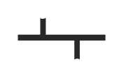

# Icon3

## Definition

```
{
  _style: { 
    entity: 'verticalLabelPosition=bottom;sketch=0;html=1;fillColor=#282828;strokeColor=none;verticalAlign=top;pointerEvents=1;align=center;shape=mxgraph.cisco_safe.iot_things_icons.icon3;',
  },
  _width: 50,
  _height: 24,
}
```

## Usage

```
import { Icon3 } from '@diac/standard-components-diagrams/ciscoSafeIotThingsIcons'

<Icon3/>
```

## Preview


