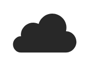

# Cloud Based

## Definition

```
{
  _style: { 
    entity: 'verticalLabelPosition=bottom;sketch=0;html=1;fillColor=#282828;strokeColor=none;verticalAlign=top;pointerEvents=1;align=center;shape=mxgraph.cisco_safe.security_icons.cloud_based;',
  },
  _original_width: 50,
  _original_height: 31.5,
}
```

## Usage

```
import { CloudBased } from '@dinghy/standard-components-diagrams/ciscoSafeSecurityIcons'

<CloudBased/>
```

## Preview


