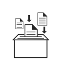

# Log Management

## Definition

```
{
  _style: 'verticalLabelPosition=bottom;sketch=0;html=1;fillColor=#282828;strokeColor=none;verticalAlign=top;pointerEvents=1;align=center;shape=mxgraph.cisco_safe.security_icons.log_management;',
  _width: 30,
  _height: 37.5,
}
```

## Usage

```
import { LogManagement } from '@reactiac/standard-components-diagrams/ciscoSafeSecurityIcons'

<LogManagement/>
```

## Preview


