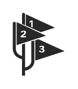

# Trustsec

## Definition

```
{
  _style: 'verticalLabelPosition=bottom;sketch=0;html=1;fillColor=#282828;strokeColor=none;verticalAlign=top;pointerEvents=1;align=center;shape=mxgraph.cisco_safe.security_icons.trustsec;',
  _width: 41.5,
  _height: 50,
}
```

## Usage

```
import { Trustsec } from '@reactiac/standard-components-diagrams/ciscoSafeSecurityIcons'

<Trustsec/>
```

## Preview


