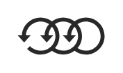

# Icon28

## Definition

```
{
  _style: 'verticalLabelPosition=bottom;sketch=0;html=1;fillColor=#282828;strokeColor=none;verticalAlign=top;pointerEvents=1;align=center;shape=mxgraph.cisco_safe.technology_icons.icon28;',
  _width: 50,
  _height: 21.5,
}
```

## Usage

```
import { Icon28 } from '@diac/standard-components-diagrams/ciscoSafeTechnologyIcons'

<Icon28/>
```

## Preview


