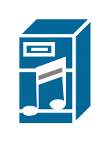

# Cisco Servers Entities

- [CiscoUnifiedPresenceServer](./cisco-unified-presence-server.md)  

- [CommunicationsServer](./communications-server.md)  

- [DirectoryServer](./directory-server.md)  

- [FileServer](./file-server.md)  

- [Fileserver](./fileserver.md)  

- [Host](./host.md)  

- [IptvServer](./iptv-server.md)  

- [Microwebserver](./microwebserver.md)  

- [MohServer](./moh-server.md)  

- [ServerWithRouter](./server-with-router.md)  

- [SipProxyServer](./sip-proxy-server.md)  

- [SoftwareBasedServer](./software-based-server.md)  

- [StandardHost](./standard-host.md)  

- [StorageServer](./storage-server.md)  

- [UnityServer](./unity-server.md)  

- [VoiceCommserver](./voice-commserver.md)  

- [WwwServer](./www-server.md)  

