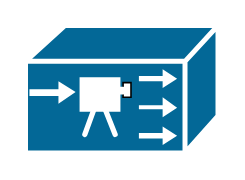

# IPTV Server

## Definition

```
{
  _style: { 
    entity: 'shape=mxgraph.cisco.servers.iptv_server;sketch=0;html=1;pointerEvents=1;dashed=0;fillColor=#036897;strokeColor=#ffffff;strokeWidth=2;verticalLabelPosition=bottom;verticalAlign=top;align=center;outlineConnect=0;',
  },
  _width: 77,
  _height: 51,
}
```

## Usage

```
import { IptvServer } from '@diac/standard-components-diagrams/ciscoServers'

<IptvServer/>
```

## Preview


