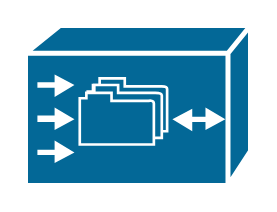

# Cisco Storage Entities

- [CiscoFileEngine](./cisco-file-engine.md)  

- [Cloud](./cloud.md)  

- [Diskette](./diskette.md)  

- [FcStorage](./fc-storage.md)  

- [FibreChannelDiskSubsystem](./fibre-channel-disk-subsystem.md)  

- [FileCabinet](./file-cabinet.md)  

- [RelationalDatabase](./relational-database.md)  

- [TapeArray](./tape-array.md)  

- [WebCluster](./web-cluster.md)  

